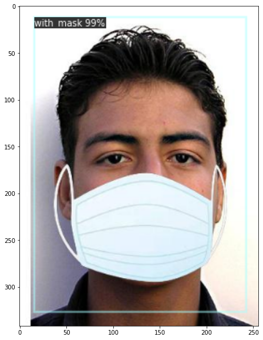

# Face-Mask-Detection with Detectron2

## 1. Installation

## 2. Collecting Data

I used images from pyimagesearch by Adrian Rosebrock

## 3. Labelling Data
We have completed collecting images, now next step is Labelling the data. Labeling is the process of drawing bounding boxes around the objects.
LabelImg is the tool which I have used, LabelImg saves the image as xml file containing the label data for each image.

## 4. Preparing data for training
We have to prepare the data so that it is easy to use for training.
In Detectron2 we can read a dataset directly if it's in coco format.

For more information check out the [official documentation](https://detectron2.readthedocs.io/tutorials/datasets.html#register-a-dataset)

## 5. Loading the data and trainig the model
The complete training process can be found in the 

## 6. Using model for inference
With the training model, now we can use if for inference by simply loading in the weights and config and creating Default Predictor.

## Author 
  **Haneesh Beerelly**
##### Reference
  ***Gilbert Tanner***
